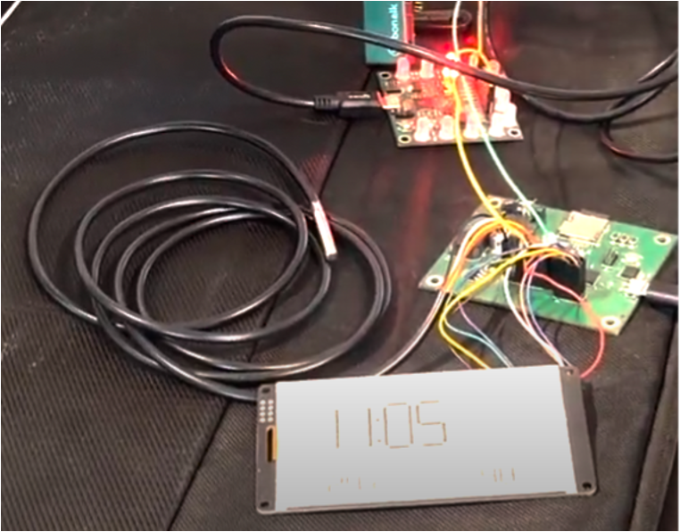
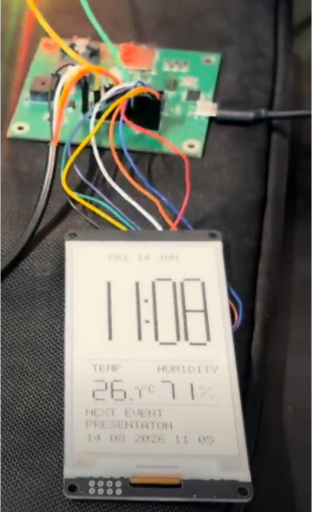
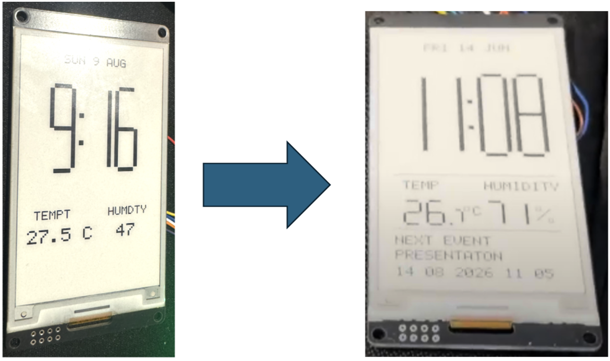
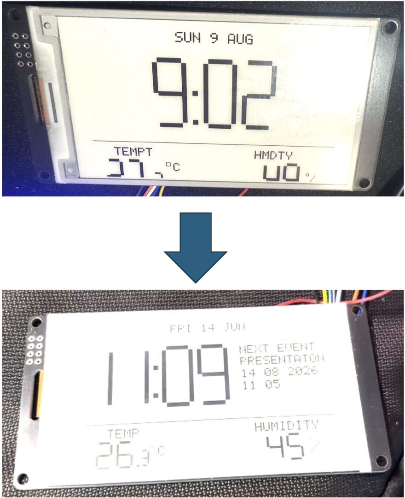
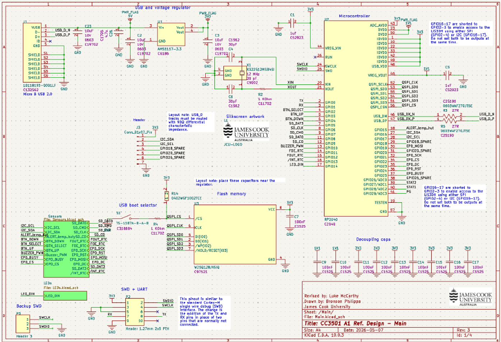
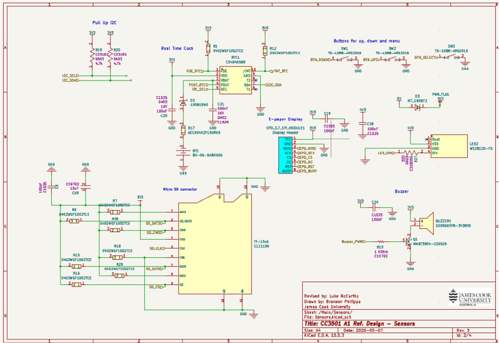
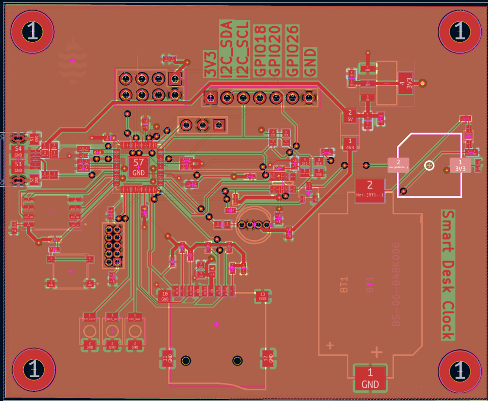

# Smart Desk Clock

  

An RP2040-based embedded desk clock integrating accurate timekeeping, environmental monitoring, event storage, alarms and an orientation-responsive e-paper interface.

This project was developed in 2026 by a three-person James Cook University engineering team. The final prototype combined a custom PCB with external peripherals and modular device drivers.

## Features

* Accurate date and time using a dedicated real-time clock
* Backup battery for continued timekeeping when main power is disconnected
* User-configurable alarm with audible buzzer output
* Ambient temperature and relative humidity monitoring
* MicroSD storage for environmental data and upcoming events
* E-paper interface displaying:

  * Current time and date
  * Temperature and humidity
  * Upcoming event information
* Automatic horizontal and vertical display layouts
* Orientation detection using an external development-board accelerometer
* Three physical buttons for time adjustment, alarm configuration and alarm dismissal
* Expansion header providing I2C, GPIO, 3.3 V and ground connections
* Custom PCB designed in KiCad
* Fusion 360 enclosure design

## Final Prototype

The Smart Desk Clock uses the RP2040 as its main controller. Independent hardware drivers were developed for the RTC, environmental sensor, e-paper display, MicroSD card, buttons and buzzer before being integrated into the main application.

The prototype was designed around manufacturing and cost constraints. Battery power management and hazardous-gas sensing were removed from the final PCB after a design review, while expansion headers were introduced to preserve support for external peripherals without increasing manufacturing cost.

  
  

  <em>Set up of the final smart desck clock.</em>

## Hardware

| Component                           | Purpose                                                      |
| ----------------------------------- | ------------------------------------------------------------ |
| RP2040                              | Main system controller                                       |
| INS5699S RTC with backup battery    | Maintains the current time and date                          |
| SEN0546 temperature/humidity sensor | Measures ambient temperature and relative humidity           |
| E-paper display                     | Displays time, environmental information and upcoming events |
| MicroSD card                        | Stores environmental data and user-defined events            |
| Development-board accelerometer     | Detects horizontal or vertical orientation                   |
| Three tactile buttons               | Time adjustment, alarm configuration and alarm dismissal     |
| Buzzer with transistor driver       | Provides audible alarm output                                |
| Custom KiCad PCB                    | Integrates the RP2040 and system interfaces                  |
| Expansion header                    | Exposes I2C, spare GPIO, 3.3 V and ground                    |

## Communication Interfaces

The system combines multiple embedded communication methods:

| Interface      | Connected hardware                            |
| -------------- | --------------------------------------------- |
| I2C at 100 kHz | INS5699S RTC and SEN0546 environmental sensor |
| SPI            | E-paper display                               |
| SPI with FatFs | MicroSD card                                  |
| GPIO           | Buttons, buzzer and orientation-state input   |

The RTC and temperature/humidity sensor share the same I2C bus. Separate SPI interfaces are used for the e-paper display and MicroSD card.

## Display and Orientation Control

The e-paper interface combines information from the RTC, environmental sensor and MicroSD card into a single display.

An accelerometer on an external RP2040 development board determines the physical orientation of the clock. The development board sends a binary orientation state to the main PCB through GPIO. The main application then selects either the horizontal or vertical display layout and refreshes the screen when the orientation changes.

This approach provided orientation-aware functionality without requiring another custom-PCB revision.

  

  

  <em>Evolution from intial to final design for vertical and horizontal screen displays.</em>

## Event Storage and Environmental Logging

MicroSD support was implemented using FatFs.

Two text files are used by the application:

* `data.txt` stores temperature and humidity measurements.
* `events.txt` stores upcoming event information.

When the display updates, the application checks whether the current event has passed. Expired events are removed and the next upcoming event is returned for display.

## User Controls

The three physical buttons provide the following functions:

1. Enter time-adjustment mode
2. Dismiss a sounding alarm
3. Enter alarm-configuration mode

The alarm time is compared with the current RTC time during operation. When the configured time is reached, the RP2040 activates the buzzer through its transistor driver.

## PCB Design

The custom PCB was developed in KiCad through multiple design revisions.

The design process included:

* RTC and environmental-sensor circuit design
* Shared I2C bus and pull-up resistor selection
* E-paper and MicroSD interfaces
* Buzzer driver circuitry
* Expansion headers
* Alternative component-placement investigations
* RP2040-centred PCB redesign
* Power and decoupling-capacitor placement
* Ground and 3.3 V copper pours
* Electrical-rule and design-rule checking
* Bill-of-materials optimisation
* Manufacturing-file preparation

The initial design exceeded the available manufacturing budget. Battery-management and air-quality circuitry were therefore removed, and external expansion connections were used to reduce cost while retaining future expandability.

  
  

  <em>KiCad schamtic pages.</em>

  

  <em>KiCad PCB editor layout.</em>

## Testing and Debugging

Subsystem development began on RP2040 development boards while the manufactured PCB was delayed in transit. This allowed the RTC, sensor, display and MicroSD functionality to be tested independently before final integration.

Notable debugging work included:

* Verifying RTC register reads and BCD date/time conversion
* Integrating the RTC and environmental sensor on a shared I2C bus
* Correcting e-paper SPI clock and chip-select assignments
* Moving hardware pin definitions into a central configuration header
* Replacing an unreliable orientation-output pin during inter-board testing
* Testing horizontal and vertical display layouts
* Integrating MicroSD event retrieval with the display
* Debugging buttons, alarm behaviour and buzzer control
* Performing final system-level integration and demonstration testing

## Team

Developed collaboratively by:

* Latrel Heron
* Harry McRae
* Jonathon Bramich

### Latrel Heron

Latrel’s work included:

* RTC and temperature/humidity circuitry in KiCad
* Shared I2C connections and supporting components
* Alternative and revised PCB-layout development
* RTC and environmental-sensor firmware
* Development-board orientation firmware
* Horizontal and vertical e-paper layouts
* E-paper testing, debugging and integration
* Integration of RTC, sensor, MicroSD and orientation data into the final display
* System testing and final hardware/software integration

The complete Git history and project documentation provide further detail on the team’s development activity.

## Limitations

* Full e-paper refreshes take approximately 1.5 to 2 seconds.
* The display was refreshed once per minute during normal operation.
* Reliable partial-refresh functionality was not completed within the project period.
* The small, closely spaced buttons were difficult to access in the enclosure.
* Orientation detection required an additional development board and internal wiring.
* Manufacturing and delivery delays reduced the available integration and testing time.
* The final prototype required external power rather than rechargeable battery operation.

## Future Improvements

* Integrate an accelerometer directly onto the main PCB
* Add Bluetooth configuration for events, alarms and automatic time synchronisation
* Reintroduce rechargeable battery management and a physical power switch
* Replace the external environmental sensor with a smaller integrated component
* Refresh environmental information when measurements change by a defined threshold
* Improve e-paper partial-refresh support
* Use larger and better-positioned physical controls
* Refine the enclosure after reducing the number of external components
* Provide a mobile interface for reading logged data and updating events

## Tools and Technologies

* C and C++
* Raspberry Pi Pico SDK
* RP2040
* CMake
* Git and GitHub
* KiCad
* Fusion 360
* I2C
* SPI
* GPIO
* FatFs
* E-paper display development

## Project Outcome

The final prototype successfully integrated timekeeping, alarms, temperature and humidity monitoring, event storage, physical controls and orientation-responsive e-paper layouts.

The project provided practical experience in embedded firmware, PCB design, peripheral communication, manufacturing constraints, hardware/software integration and systematic debugging.
